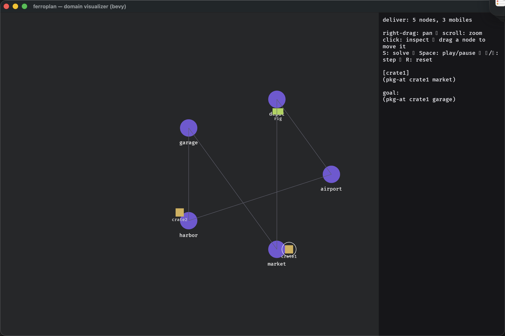

<p align="center">
  
</p>

# ferroplan

[](https://github.com/haroldhhersey/ferroplan/actions/workflows/ci.yml)
[](https://haroldhhersey.github.io/ferroplan)
[](#license)

A fast, data-parallel **PDDL planner** in Rust.

`ferroplan` is a from-scratch reimplementation of the FF family of planners with a
data-oriented core (bitset states, structure-of-arrays / CSR operator tables),
**enforced hill-climbing** (EHC) with a best-first fallback, parallel grounding
and parallel heuristic evaluation, plus an SGPlan-style partition-and-resolve mode,
PDDL3 preference/metric optimization, and **PDDL2.1 temporal** planning (durative
actions). It ships both a **library** (with a structured, JSON-serializable API)
and the **`ff`** command-line binary — a drop-in for Metric-FF's
`ff -o domain -f problem`.

On classical and ADL benchmarks it runs within ~1.4× of the heavily-optimized C
Metric-FF (EHC reaches goals in dozens of evaluations, not thousands); numeric
trails and IPC-5 preference quality is competitive-not-winning — see
[Benchmarks](#benchmarks).

> Status: **v0.1**, not yet on crates.io. APIs may shift before 1.0.

## Features

- **EHC + best-first** — enforced hill-climbing with helpful actions (the FF
  speed default), falling back to weighted best-first when it stalls. Selectable
  per solve (`--search auto|ehc|best-first|…`).
- **FF heuristic** — delete-relaxation relaxed-plan heuristic over a
  data-oriented task, deferred evaluation, tunable `g`/`h` weights.
- **Data parallelism** — parallel grounding and parallel batch heuristic
  evaluation (`std::thread`); the plan found is identical for any thread count.
- **PDDL coverage** — STRIPS, typing, negative/disjunctive preconditions,
  numeric fluents (Metric-FF style), and **ADL** (conditional effects,
  `forall`/`exists`, equality).
- **PDDL3 preferences** — soft goal preferences (incl. `forall`-quantified and
  precondition preferences) compiled away, with anytime branch-and-bound metric
  optimization. *(Exact-optimal on small/medium instances; best-found, flagged,
  on the largest — see [Limitations](#limitations).)*
- **PDDL2.1 temporal** — `:durative-action`s with `at start`/`over all`/`at end`
  conditions & effects, **constant or parameter-dependent durations**, and
  required concurrency, via a decision-epoch forward search; output in the IPC
  temporal plan format (`t: (action) [dur]`) with a makespan.
- **SGPlan-style partitioning** — an optional partition-and-resolve mode.
- **Robust** — a published library shouldn't crash: malformed/pathological PDDL
  (incl. deeply-nested forms) returns a typed error, never a panic.
- **Structured output** — the library returns typed, `serde`-serializable
  results; the CLI emits classic FF text **or** JSON.

## GUI

[`ferroplan-bevy`](crates/ferroplan-bevy) is a Bevy app that visualizes a
domain+problem as a typed graph, animates the plan, and edits both problems and
domains in a Blockly-style block editor (`cargo run -p ferroplan-bevy`).



## Install / build

```sh
cargo build --release          # produces target/release/ff
cargo run --release --bin ff -- -o domain.pddl -f problem.pddl
```

## CLI (`ff`)

```sh
# drop-in: classic Metric-FF text output
ff -o domain.pddl -f problem.pddl

# structured JSON solution
ff -o domain.pddl -f problem.pddl --json

# pick a mode / search strategy
ff -o domain.pddl -f problem.pddl --mode partition
ff -o domain.pddl -f problem.pddl --search best-first --weight-h 3

# temporal (durative actions) — auto-detected; prints the IPC temporal plan
ff -o temporal-domain.pddl -f problem.pddl --mode temporal

# self-contained JSON job: {"domain": "...", "problem": "...", "options": {...}}
ff --json-request job.json
```

Run `ff --help` for all flags (`--search`, `--weight-g/--weight-h`,
`--max-evaluated`, `--satisfice`, `--threads`, …).

## Library

```rust
use ferroplan::{solve, Options};

let domain  = std::fs::read_to_string("domain.pddl")?;
let problem = std::fs::read_to_string("problem.pddl")?;

let solution = ferroplan::solve(&domain, &problem, &Options::default())?;
if let Some(plan) = solution.plan {
    for step in &plan.steps {
        println!("{} {}", step.action, step.args.join(" "));
    }
    println!("metric: {:?}", plan.metric);
}
# Ok::<(), ferroplan::SolveError>(())
```

See [`examples/`](crates/ferroplan/examples) for `solve` and `json_api`.

## Configuration

Every solver knob lives on one `Options` struct (library-first, `serde`-
serializable). The CLI flags and JSON job options map to the same fields; omitted
JSON fields fall back to the defaults shown.

```rust
ferroplan::solve(&domain, &problem, &ferroplan::Options {
    mode:            Mode::Auto,        // auto | ff | partition | pddl3 | temporal
    search:          Search::Auto,      // auto | ehc | best-first | ehc-then-best-first
    helpful_actions: true,              // helpful-action pruning (EHC)
    weight_g:        1.0,               // best-first path-length weight
    weight_h:        5.0,               // best-first heuristic weight  (1·g + 5·h)
    threads:         0,                 // 0 = auto
    max_evaluated:   None,              // search node cap
    optimize:        true,              // PDDL3: optimize metric vs. satisfice
    ..Default::default()                // every field is optional
})?;
```

CLI equivalents: `--mode`, `--search`, `--no-helpful`, `--weight-g/--weight-h`,
`--max-evaluated`, `--satisfice`, `--threads`. Via JSON:
`{"domain": "...", "problem": "...", "options": {"search": "best-first"}}`.

## Workspace layout

| crate | what |
|---|---|
| [`ferroplan`](crates/ferroplan) | the library: engine + modes + `solve` API |
| [`ferroplan-cli`](crates/ferroplan-cli) | the `ff` binary (clap + JSON) |
| [`ferroplan-bevy`](crates/ferroplan-bevy) | Bevy app: visualize, inspect & animate a domain+problem (`cargo run -p ferroplan-bevy [domain.pddl problem.pddl]`) |

## Benchmarks

Compared against the C **Metric-FF** and **SGPlan6** planners over a subset of
the IPC contest suites. Headline (native Metric-FF, EHC default):

| category | ferroplan solved | speed vs Metric-FF |
|---|---:|---|
| STRIPS | 40/40 | 0.71× (~1.4× slower) |
| ADL | 23/24 | 0.77× (~1.3× slower) |
| numeric | 36/40 | 0.22× |

Full results + the IPC-5 preference scoreboard: [`benchmarks/results.md`](benchmarks/results.md)
(and the [project site](https://haroldhhersey.github.io/ferroplan)). The oracles
are not bundled (GPL / non-commercial licences) — reproduce per
[`benchmarks/COMPARING.md`](benchmarks/COMPARING.md).

**Profiling & perf tracking:** [`PROFILING.md`](PROFILING.md) — a deterministic
metrics harness (`benchmarks/perf.py run`/`compare` against a committed baseline,
so improvement/regression is measurable across machines) plus the samply /
flamegraph / criterion-baseline workflow for finding and tracking hotspots.

## Limitations

- **Numeric** trails Metric-FF: EHC's helpful-action lookahead stalls on some
  numeric domains and falls back to (complete, slower) best-first.
- **IPC-5 preferences**: compiled away + anytime branch-and-bound. Coverage is on
  par with SGPlan6 (≈39/48 on the simple-preferences suite), but on the hardest
  instances the *metric quality* trails SGPlan6's specialised partition-and-penalty
  search (best-found, flagged *not proven optimal*). Closing that gap needs the
  full ESPC penalty-coordination loop — specced in
  [`docs/espc-preferences-spec.md`](docs/espc-preferences-spec.md), not yet built.
- **Temporal**: durative actions with constant or parameter-dependent durations
  and required concurrency are supported, and **plans are VAL-validated** on real
  IPC temporal domains (44/45 produced plans valid — see
  [`benchmarks/temporal-results.md`](benchmarks/temporal-results.md)). Coverage is
  currently search-limited (the decision-epoch search times out on large
  instances); duration *inequalities*, timed initial literals, and continuous
  (`#t`) effects are not yet supported.
- Derived predicates (`:derived`) are not supported.

## License

Dual-licensed under either of [MIT](LICENSE-MIT) or [Apache-2.0](LICENSE-APACHE),
at your option.
