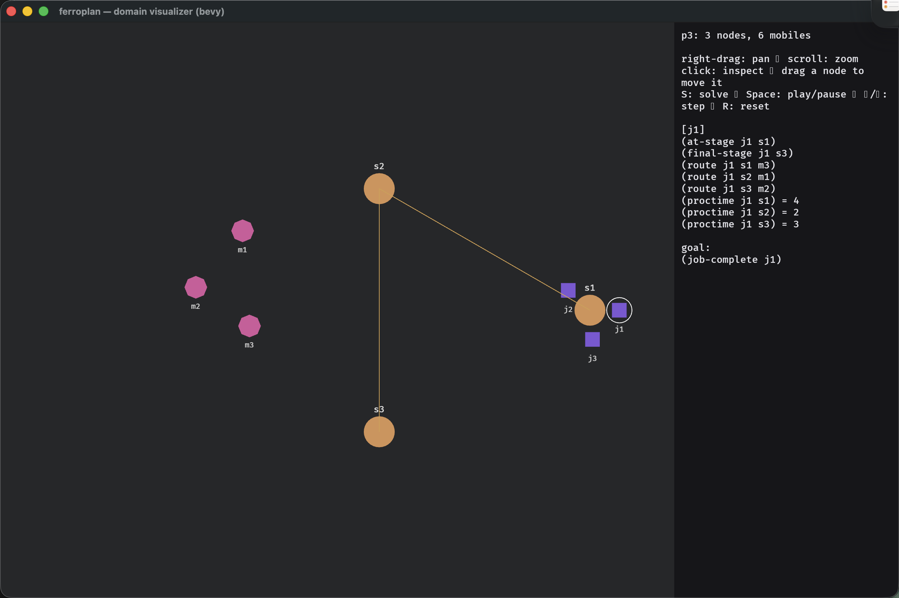
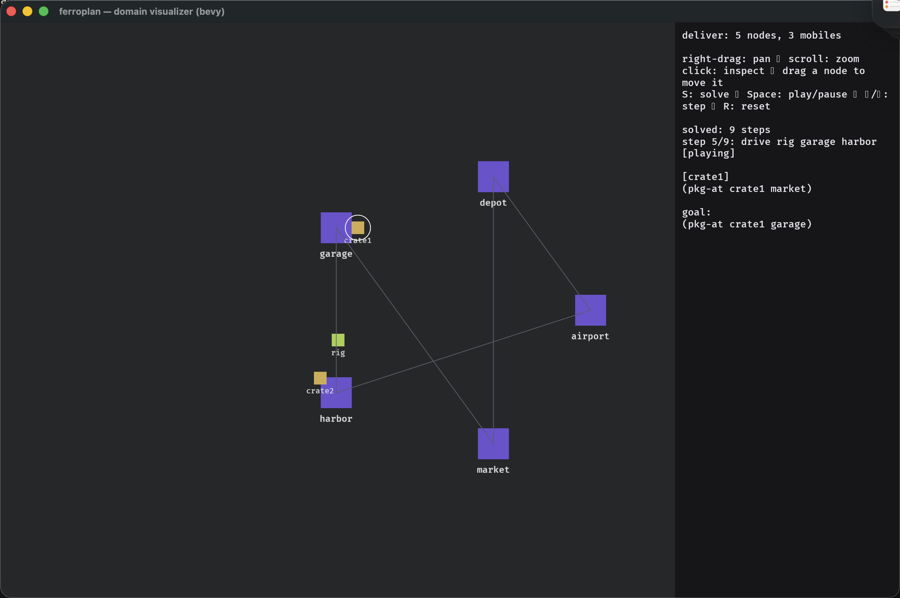
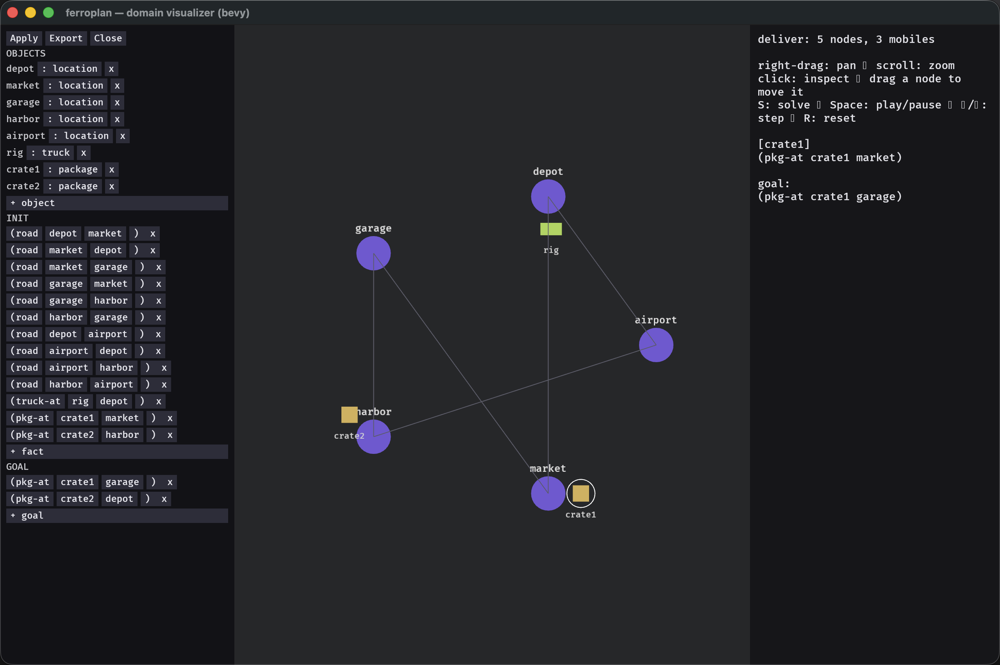
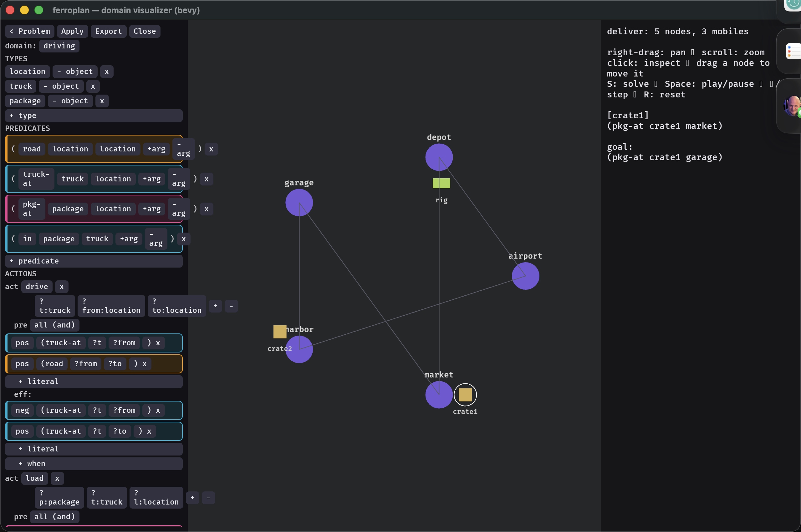

# GUI (`ferroplan-bevy`)

`ferroplan-bevy` is a [Bevy](https://bevyengine.org/) app that turns a PDDL
domain + problem into something you can *see*: a force-directed graph of the
problem, an animated plan, and a Blockly-style block editor for both the problem
and the domain.

```sh
cargo run -p ferroplan-bevy                       # start empty, load via the editor
cargo run -p ferroplan-bevy domain.pddl problem.pddl
```

## Visualize a domain + problem as a graph

Static objects become **nodes**, laid out force-directionally, with per-type
icons (a circle for `location`, a square for the mobile `package`/`truck` types);
static binary predicates (e.g. `road`) become **edges**. The current state is
drawn *on* the graph — a package sits on the node it's `at`. Right-drag pans,
scroll zooms, click inspects a node, and you can drag a node to reposition it.


*The problem as a typed graph — locations are circles, mobiles are squares, `road` predicates are edges. The side panel shows the inspected object and the goal.*

The icons and edge colors are inferred from the PDDL — there's no per-domain
config. A **logistics** problem shows the package as a box and trucks/train as
mobiles, with rail legs drawn in blue and roads in gray:


*Logistics — rail (blue) vs road (gray) edges are distinguished automatically.*

A **job-shop** schedule shows machines as octagons, jobs as boxes, and the stage
routing (`s1→s2→s3`) in amber:


*Job-shop — machines (octagons), jobs (boxes), and stage routing (amber).*

## Animate the plan

Press **S** to solve (it calls the same `ferroplan::solve` the CLI uses) and
**Space** to play. The plan replays step by step — mobiles slide along edges as
each action fires — with the current step echoed in the side panel. Arrow keys
step manually; **R** resets to the initial state.


*A plan animating mid-step — the side panel tracks `step 5/9` while the mobiles move along the graph.*

## Block editor — problems

The editor is a Blockly-style, drag-and-snap surface: no PDDL syntax to get
wrong. The **problem editor** edits objects (typed), the init facts, and the
goal as nested blocks; **Apply** re-parses and re-renders the graph live,
**Export** writes the PDDL back out.


*The problem editor — objects, init, and goal as typed blocks; Apply re-renders the graph, Export writes PDDL.*

## Block editor — domains

The editor goes all the way down to the **domain**: types and predicates...


*The domain editor — the type hierarchy and predicate signatures as editable blocks.*

...and the **actions** — each action's parameters, precondition, and effect as
positive/negative literal blocks, so you can author or tweak operators without
touching a text file.


*The action editor — parameters plus precondition and effect literals (positive / negative) per action.*

> The editor and the solver share the same parser and `solve` entry point as the
> `ff` CLI, so what you see is exactly what the planner sees.
