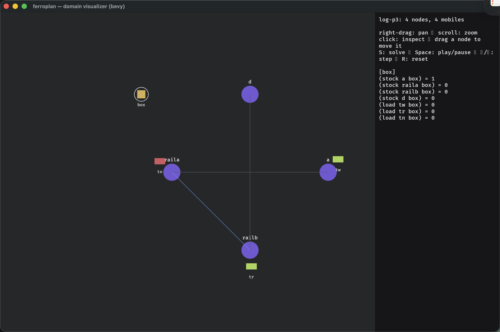

# logistics — a transshipment domain (per-location goods)

The truck → depot → train shape rpg-world **can't** express (its stockpile is
global). Here goods are **per-location**: packages sit at locations, vehicles
(trucks with a capacity, plus a train line) **move** between connected locations
carrying packages, and load/unload happens at depots. Goal = packages delivered to
their destinations. This is routing + capacity + transshipment — a distinct
sub-problem type.



## Problems & the border

| problem | what | result |
|---|---|---|
| `p1` | single hop, 1 box | ✅ 4 |
| `p2` | 3-hop corridor, 1 box | ✅ 10 |
| `border-probe-4c` | 1 truck cap 3, **1** box A→C | ✅ 7 |
| `border-probe-train1` | train only, 1 box railA→railB | ✅ 6 |
| `border-probe-4b` | 1 truck cap 3, **2** boxes A→C | ❌ |
| `border-probe-handoff` | **2-truck** relay via a mid depot, 1 box | ❌ |
| `p3` | truck→train→truck transshipment, 1 box | ❌ |
| `p4` | capacity batching, 1 truck cap 3, 3 boxes | ❌ |
| `p5`–`p8` | multi-package / star-hub / scaling | ❌ |

**Border: multiplicity 1.** A single package moved by a single vehicle over any
number of hops solves. The moment there are **2 packages**, a **2nd vehicle**, or a
**transshipment hand-off**, it fails — because per-location delivery is a
converging-flow problem (≥2 contributions onto one "delivered" goal), exactly the
[`BORDERS.md`](../BORDERS.md) *converging-contributions ≥ 2* failure. Deep travel
stays free (matching rpg-world). For a subproblem-maker: **one package, one
vehicle, one leg per contract**; split at every transshipment point.

```sh
ff -o examples/logistics/domain.pddl -f examples/logistics/p1.pddl
```
